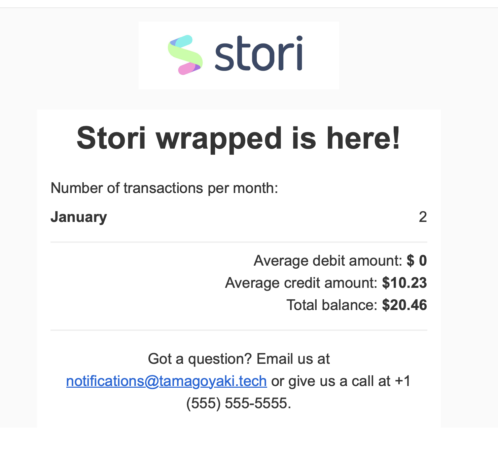

## functional requirements
- REST api to get the user transaction summary
- save user transactions in a database
- save user transactions in a file (csv)
- send transaction summary through email
- register user in the system (name, email) 

## non functional requirements

- error prone
- scalable
- Usability
- maintainable
- testable

## data model

```
 Transaction {
    id int
    Date date
    Transaction float    
 }

  User {
      id int
      name string
      email string
      transactions []Transaction
  }

  TransactionSummary {
      user User
      total float
      averageCredit float
      averageDebit float
      numberOfTransactionsPerMonth []TransactionPerMonth
  }

  TransactionPerMonth {
      month int
      numberOfTransactions int
  }  

```

## CSV storage 

to keep it simple we are going to execute a linear search O(n) to look and see if the user does exist 

index file
    user_id, Email, file_name

user file
    Id, Date, Transaction

## postgres storage

User table
    Id uuid
    Name string
    Email string

Transaction table
    Id uuid
    UserId uuid
    Date date
    Transaction float

## ports | REST api

- GET /users/{id}/transactions/summary - 200 OK
  - res: { summaryId: int,  status: "INPROGRESS", notification-data:{
            notificationId: int,
            recipient: string,
            subject: string
            timestamp: date
        }}
        
- POST /users/{id}/transactions - 202 Accepted
  - body: { date: "2020-01-01", transaction: 100.00 }

- POST /users - 201 Created
  - body: { name: "John Doe", email: "example@example.com" }
  - res: { id: int, name: string, email: string }


## generating openapi types and server

```bash
    make openapi_http
```

## test 

```bash
    make test
```

## update docker image

```bash
    docker tag  summary registry.digitalocean.com/money-transfer/summary
```

## push docker image

```bash
    docker push registry.digitalocean.com/money-transfer/summary
```


## (REST API), quick guide

> **Warning**
> the process to receive a mail is, create user -> add transactions to the user -> get summary of user transactions


### get summary of user transactions

```bash
  curl --request GET \
  --url http://localhost:3000/api/users/067bdf1c-ac8f-4cb5-9eb0-be7bb4df8442/transactions/summary
```

```json
{"data":{"notificationId":"e84d45f4-381d-475e-a781-0ae13a45e5ea","recipient":"067bdf1c-ac8f-4cb5-9eb0-be7bb4df8442","timestamp":"2023-06-12T22:59:43.511501337Z"},"status":"completed","summaryId":"e84d45f4-381d-475e-a781-0ae13a45e5ea"}    
```


> example of email sent

### create user

```bash
curl --request POST \
  --url http://localhost:3000/api/users \
  --header 'Content-Type: application/json' \
  --data '{
	"email":"me@eduaravila.com",
	"name":"eduardo"
}'
```

```json
{"email":"me@eduaravila.com","id":"b37d988b-0df5-4d10-977c-f401d5045ae3","name":"eduardo"}
```


### create transaction

```bash
curl --request POST \
  --url http://localhost:3000/api/users/b37d988b-0df5-4d10-977c-f401d5045ae3/transactions \
  --header 'Content-Type: application/json' \
  --data '{
	"date": "2006-01-02",
	"amount": 10.2323
}'
```

```
  200 OK
```


